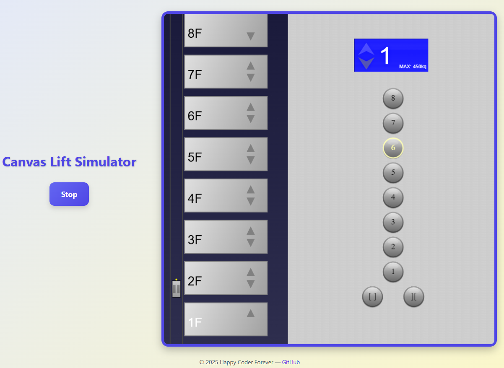

# Canvas Lift Simulator


## Screenshot



## Introduction

Elevator Cabin Simulator is a **TypeScript + HTML Canvas** project that simulates real-world elevator behaviors.  
It models calling elevators, moving to a specific floor, opening and closing doors, and waiting at floors—offering a visually accurate and interactive simulation.

## How to Run

```bash
npm install
npm run dev
```

Open `index.html` in your browser or use the dev server to run the simulator.

## Future Improvements

- [ ] Logic for people getting on and off the cabin
- [ ] Preventing exceeding the maximum load
- [ ] Multiple elevator behavior (optional)

## License

This project is licensed under the **MIT License**.

## Contributing

Contributions are welcome! Feel free to submit issues, suggestions, or pull requests to improve the simulator.

******